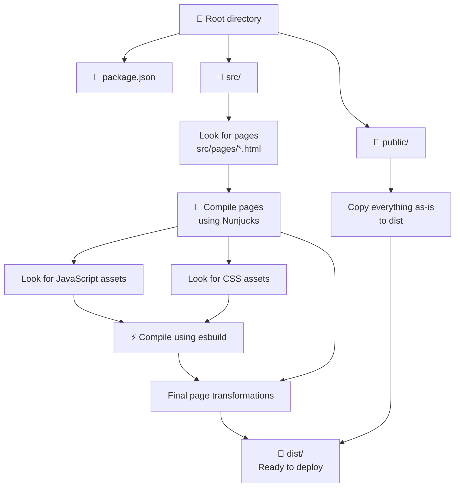

[](https://github.com/Athlon1600/makepages/actions/workflows/nodejs.yml)


# MakePages

MakePages is a simple and easy-to-use **static site generator** for Node.js.

Use it to generate a self-contained website that requires no server side rendering, and is easy to deploy anywhere.

## Why another static site generator?

MakePages was built as a simpler alternative to other site generators that describe themselves as simple, but usually:

- require too much additional configuration
- have a steep learning curve
- limit pages to Markdown language only
- focus too much on blogs or documentation sites

The goal of MakePages is to:

- be good enough for 90+% of use cases
- be extremely simple to use
- work out of the box with a single command
- have documentation that fits on a single 5-minute read page 

In the past, I created my own custom build scripts using a combination of webpack (HtmlWebpackPlugin especially), esbuild, nunjucks, chokidar and other libraries.
MakePages finally combines all of that into a single command-line application.

## :heavy_check_mark: Features

- Write your pages in plain HTML which allows for infinite flexibility.
- Nunjucks templating support out of the box. See: https://mozilla.github.io/nunjucks/
- Uses file-system based routing (`src/pages/about.html` => `/about.html`)
- Uses `esbuild` to compile assets referenced inside your pages, which is much faster than what other site generators
  use.
- Asset versioning (`/styles.css` => `/styles-4cded09.css`)
- Automatic JS/CSS inlining when it makes sense.

## :zap: Quick Start

**Requirements:** Node.js version 18 or newer.

Install MakePages globally or locally:

```shell
## Install globally
npm install -g makepages

## Install locally
npm add makepages
```

Create a directory for your project and navigate into it.

```shell
mkdir example.com
cd example.com
```

Once inside, simply run either:

```shell
# If installed globally
makepages dev

## If NOT installed
npx makepages dev
```

The `dev` command builds your website into a `dist` folder, watches for changes,
and starts a local server to preview your website:
- http://localhost:9000

If your chosen directory is empty, MakePages will populate it with a basic starter website.

## :desktop_computer: Try it out

The `apps/example` folder contains a sample project that you can explore live:

[](https://stackblitz.com/github/Athlon1600/makepages/tree/master/apps/example?file=src%2Fpages%2Findex.html)

## :file_folder: Website Folder Structure

MakePages expects a specific folder structure. At minimum, your project needs a `src/pages` directory to read your pages
from. 

See how the entire build process works in the chart below:



## :rocket: Deploy

When you are ready to publish your site, run:

```shell
makepages build --production
```

This will build a **production optimized** website into a `dist` folder, which you can then upload to your hosting provider.

Our example website is automatically configured to deploy to multiple providers at once:

| Provider   | Website URL                                                              |
|------------|--------------------------------------------------------------------------|
| Netlify    | [makepages-example.netlify.app/](https://makepages-example.netlify.app/) |
| Vercel     | [makepages2.vercel.app/](https://makepages2.vercel.app/)                 |
| Cloudflare | [makepages.pages.dev/](https://makepages.pages.dev/)                     |

See the deployment logic here:

- [deploy.yml](.github/workflows/deploy.yml)

## :white_check_mark: To-do list

List of features that definitely deserve to be part of this project, but have not yet been implemented:

- [ ] Add support for TypeScript
- [ ] Add support for Sass/SCSS
