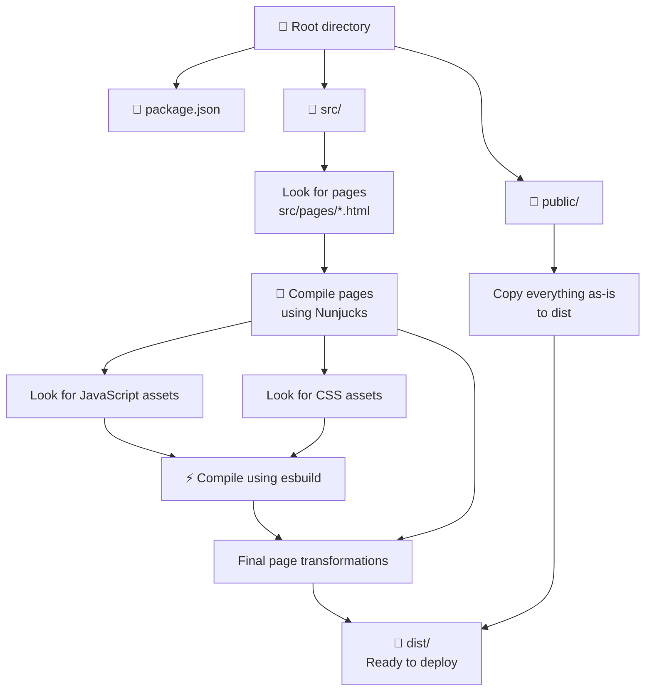

[](https://github.com/Athlon1600/makepages/actions/workflows/nodejs.yml)


# MakePages

MakePages is a very simple and flexible **static site generator** for Node.js.

Use it to generate a self-contained website that requires no server side rendering.
You can then deploy it to many free cloud hosting providers to make it load fast globally.

## :package: Installation

**Requirements:** Node.js version 18 or newer.

Install it globally on your system using npm:

```shell
npm install -g makepages
```

or you can install it into your existing project: `npm add makepages`

## :heavy_check_mark: Features

- Write your pages in plain HTML which allows for infinite flexibility.
- Nunjucks templating support out of the box. See: https://mozilla.github.io/nunjucks/
- Uses file-system based routing (`src/pages/about.html` => `/about.html`)
- Uses `esbuild` to compile assets referenced inside your pages, which is much faster than what other site generators
  use.
- Asset versioning (`/styles.css` => `/styles-4cded09.css`)
- Automatic JS/CSS inlining when it makes sense.

## Quick Start

Create a directory for your project, and then navigate into it.

```shell
mkdir example.com
cd example.com
```

Once inside, simply run:

```shell
makepages dev
```

This will both start a local server and automatically rebuild your site when you make any changes.

## :boom: Demo Playground

Folder `apps/example` contains an example website, which when deployed looks like this:

- https://makepages-example.netlify.app/

[](https://stackblitz.com/github/Athlon1600/makepages/tree/master/apps/example?file=src%2Fpages%2Findex.html)

## :file_folder: Website Folder Structure

For MakePages to work, it expects a certain folder structure. At minimum, it needs `src/pages` directory to read pages
from. See how the entire build process works in the chart below:



## :rocket: Deploy

When you are ready to publish your site, run:

```shell
makepages build --production
```

This will build a **production optimized** site into a `dist` folder, which you can then upload to your hosting provider.
